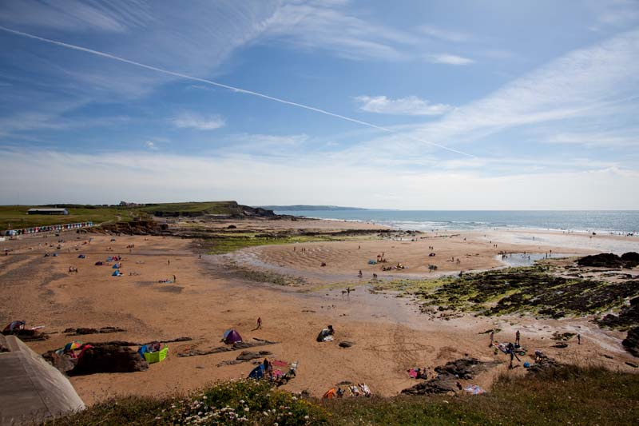
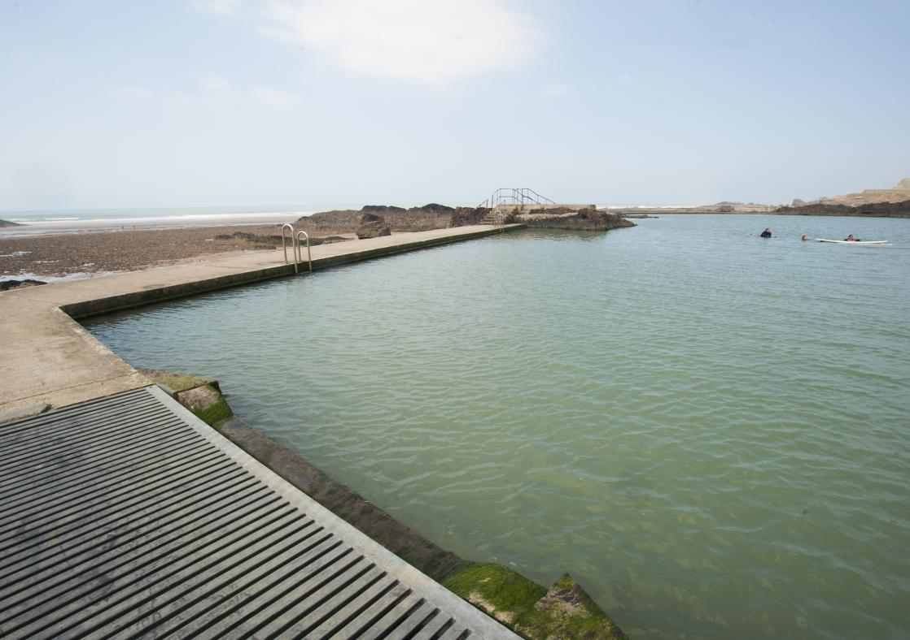
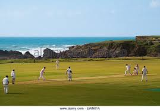
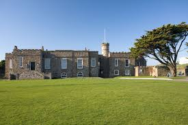
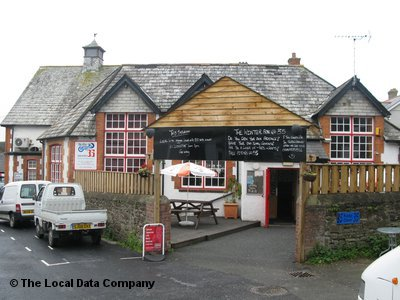

Bude is a small seaside resort town in north Cornwall, England, UK, in the civil parish of Bude-Stratton and at the mouth of the River Neet It is sometimes formerly known as Bude Haven. It lies southwest of Stratton, south of Flexbury and Poughill, and north of Widemouth Bay and is located along the A3073 road off the A39.

Map of Bude:
```{r message=FALSE}
library(ggmap)
library(tidyverse)

map <- get_googlemap(center = c(-4.55,50.83),zoom = 15)
location <- data.frame(lat=c(50.835869,50.830540,50.834467,50.829036,50.830161),
                    lon=c(-4.553962,-4.551365,-4.552814,-4.548769,-4.544088),
                    area=c("beach","beach","Cricket Club","Castle","Pub"))

from <- "Bude North Cornwall Cricket Club"
to <- "Bar 35, Belle Vue Ln, Bude EX23 8BR"
route_df <- route(from, to, structure = "route")

ggmap(map)+
  geom_point(data = location, aes(x=lon, y=lat, color = area), size =3)+
  geom_path(aes(x = lon, y = lat), colour = "pink", size = 1.4, data = route_df, lineend = "round"
  )
```
Watercolor map:
```{r message=FALSE}
map2 <- get_map(location = c(-4.55,50.83), source="stamen",maptype = "watercolor",zoom = 15)

ggmap(map2)+  
  geom_point(data = location, aes(x=lon, y=lat, color = area), size =3)+
  geom_path(aes(x = lon, y = lat), colour = "red", size = 1.4, data = route_df, lineend = "round"
  )
```

Places to go in Bude:












